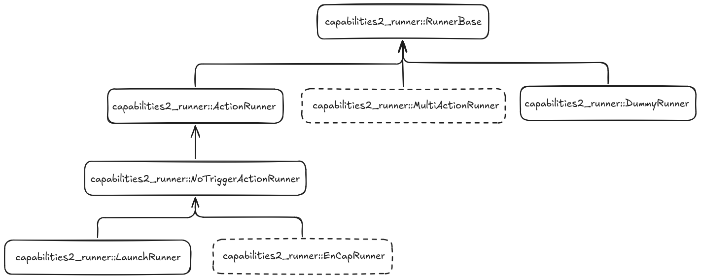

# capabilities2_runner plugin API

This package provides `runner` API for abstract provision of capabilities. Plugins extend the execution functionality of the `capabilities` system. The ROS1 implementation used launch files to start capabilities. The ROS2 implementation uses runners to start capabilities. This allows for more flexibility in how capabilities are started and stopped, or how they are managed, and operate.

## Runners

The `capabilities2_runner` package provides runners that can be used to start capabilities and create capabilities. These runners are fully tested (test files are available):

- `capabilities2_runner::RunnerBase` - The Base class for runners implementing the `Runner` interface which comprises of `start`, `stop` and `trigger` functionality.
- `capabilities2_runner::ActionRunner` - The Base runner class for capabilities that are implemented as ROS Actions. Overrides `stop` and `trigger` from RunnerBase.
- `capabilities2_runner::NoTriggerActionRunner` - A Base runner class that is also a derivative of Action Runner which disables trigger functionality. Useful for runners that has to start executing from the beginning. 
- `capabilities2_runner::LaunchRunner` - Runner for capabilities that are implemented as launch files.
- `capabilities2_runner::DummyRunner` - A sample runner that can be used to test the functionality of capabilities server.

## Experimental Runners

The `capabilities2_runner` package provides experimental runners that can be used to start capabilities. These runners are not fully tested and may not work as expected. The experimental runners are:

- `capabilities2_runner::EnCapRunner` - Base runner class that provides a capability action interface that encapsulates another action.
- `capabilities2_runner::MultiActionRunner` - Base runner class for capabilities that are implemented using multiple actions.

## Runner Inheritance Diagram


### launch runner

The `launch runner` inherits from the `action runner` and is a special case. To instatiate this runner, provide a launch file path as the `runner` tag in the capability provider.

```yaml
# provider ...
name: my_provider
spec_version: 1
spec_type: provider
implements: my_capability
# the runner to use is an exported plugin name based on RunnerBase
runner: path/to/launch_file.launch.py
```

## Inheritance Diagram

An example of the inheritance diagram for the runners is shown below. The `RunnerBase` class is the base class for all runners. The `ActionRunner` class is the base class for runners that are implemented as actions. The example shows a waypoint capability that is implemented as a single action. The `WaypointRunner` class inherits from the `ActionRunner` class.



## Creating a new runner

Runners can be created to perform capabilities. The runner can be specified in a capability provider as the `runner` tag:

```yaml
# provider ...
name: my_provider
spec_version: 1
spec_type: provider
implements: my_capability
# the runner to use is an exported plugin name based on RunnerBase
runner: capabilities2_runner::MyRunner
```

The runner should inherit from the `RunnerBase` or another like the `ActionRunner` class. The runner must implement the `start`, `stop`, and `trigger` methods, and then be registered as a plugin, using the `PLUGINLIB_EXPORT_CLASS` macro. See [Creating Runners](./docs/create_runners.md) for more information.

```cpp

### Base Runner

The `RunnerBase` class is the base class for all runners. It provides the `start`, `stop`, and `trigger` methods. The `start` method is used to start the runner, the `stop` method is used to stop the runner, and the `trigger` method is used to trigger the runner. See the `RunnerBase` class definition function templates below:

```cpp
namespace capabilities2_runner
{

  class RunnerBase
  {
  public:
    // start the runner
    virtual void start(rclcpp::Node::SharedPtr node, const runner_opts& run_config,
                     std::function<void(const std::string&)> on_started = nullptr,
                     std::function<void(const std::string&)> on_terminated = nullptr,
                     std::function<void(const std::string&)> on_stopped = nullptr) = 0;

    // stop the runner
    virtual void stop() = 0;

    // trigger the runner
    virtual std::optional<std::function<void(std::shared_ptr<tinyxml2::XMLElement>)>>
    trigger(std::shared_ptr<tinyxml2::XMLElement> parameters = nullptr) = 0;
  };

} // namespace capabilities2_runner
```

