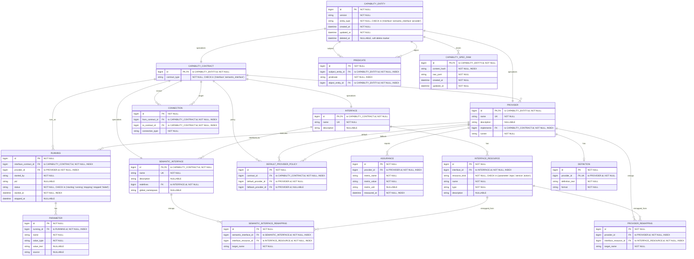

```mermaid
erDiagram
  %% Qualifier convention used below:
  %% PK, FK, NOT NULL, NULLABLE, UNIQUE, CHECK, INDEX, COMPOSITE UNIQUE

  %% Shared supertype for all first-class capability entities
  CAPABILITY_ENTITY {
    bigint id PK "NOT NULL"
    string version "NOT NULL"
    string entity_type "NOT NULL, CHECK in ('interface','semantic_interface','provider')"
    datetime created_at "NOT NULL"
    datetime updated_at "NOT NULL"
    datetime deleted_at "NULLABLE, soft delete marker"
  }

  %% Contract hierarchy remains separate from providers
  CAPABILITY_CONTRACT {
    bigint id PK, FK "to CAPABILITY_ENTITY.id, NOT NULL"
    string contract_type "NOT NULL, CHECK in ('interface','semantic_interface')"
  }

  INTERFACE {
    bigint id PK, FK "to CAPABILITY_CONTRACT.id, NOT NULL"
    string name UK "NOT NULL"
    string description "NULLABLE"
  }

  SEMANTIC_INTERFACE {
    bigint id PK, FK "to CAPABILITY_CONTRACT.id, NOT NULL"
    string name UK "NOT NULL"
    string description "NULLABLE"
    bigint redefines FK "to INTERFACE.id, NOT NULL"
    string global_namespace "NULLABLE"
  }

  PROVIDER {
    bigint id PK, FK "to CAPABILITY_ENTITY.id, NOT NULL"
    string name UK "NOT NULL"
    string description "NULLABLE"
    bigint implements FK "to CAPABILITY_CONTRACT.id, NOT NULL, INDEX"
    string runner "NOT NULL"
  }

  %% V1.2
  INTERFACE_RESOURCE {
    bigint id PK "NOT NULL"
    bigint interface_id FK "to INTERFACE.id, NOT NULL, INDEX"
    string resource_kind "NOT NULL, CHECK in ('parameter','topic','service','action')"
    string name "NOT NULL"
    string type "NOT NULL"
    string description "NULLABLE"
  }
  %% INTERFACE_RESOURCE: COMPOSITE UNIQUE (interface_id, resource_kind, name)

  PROVIDER_REMAPPING {
    bigint id PK "NOT NULL"
    bigint provider_id FK "to PROVIDER.id, NOT NULL, INDEX"
    bigint interface_resource_id FK "to INTERFACE_RESOURCE.id, NOT NULL, INDEX"
    string target_name "NOT NULL"
  }
  %% PROVIDER_REMAPPING: COMPOSITE UNIQUE (provider_id, interface_resource_id)

  SEMANTIC_INTERFACE_REMAPPING {
    bigint id PK "NOT NULL"
    bigint semantic_interface_id FK "to SEMANTIC_INTERFACE.id, NOT NULL, INDEX"
    bigint interface_resource_id FK "to INTERFACE_RESOURCE.id, NOT NULL, INDEX"
    string target_name "NOT NULL"
  }
  %% SEMANTIC_INTERFACE_REMAPPING: COMPOSITE UNIQUE (semantic_interface_id, interface_resource_id)

  %% V2
  PREDICATE {
    bigint id PK "NOT NULL"
    bigint subject_entity_id FK "to CAPABILITY_ENTITY.id, NOT NULL, INDEX"
    string predicate "NOT NULL, INDEX"
    bigint object_entity_id FK "to CAPABILITY_ENTITY.id, NOT NULL, INDEX"
  }
  %% PREDICATE: COMPOSITE UNIQUE (subject_entity_id, predicate, object_entity_id)

  CAPABILITY_SPEC_RAW {
    bigint id PK, FK "to CAPABILITY_ENTITY.id, NOT NULL"
    string content_hash "NOT NULL, INDEX"
    string raw_yaml "NOT NULL"
    datetime created_at "NOT NULL"
    datetime updated_at "NOT NULL"
  }

  DEFAULT_PROVIDER_POLICY {
    bigint id PK "NOT NULL"
    bigint contract_id FK "to CAPABILITY_CONTRACT.id, NOT NULL, INDEX"
    bigint default_provider_id FK "to PROVIDER.id, NOT NULL"
    bigint fallback_provider_id FK "to PROVIDER.id, NULLABLE"
  }
  %% DEFAULT_PROVIDER_POLICY: COMPOSITE UNIQUE (contract_id)

  ASSURANCE {
    bigint id PK "NOT NULL"
    bigint provider_id FK "to PROVIDER.id, NOT NULL, INDEX"
    string metric_name "NOT NULL"
    string metric_value "NOT NULL"
    string metric_unit "NULLABLE"
    datetime measured_at "NOT NULL, INDEX"
  }
  %% ASSURANCE: COMPOSITE INDEX (provider_id, metric_name, measured_at)

  %% V3
  RUNNING {
    bigint id PK "NOT NULL"
    bigint interface_contract_id FK "to CAPABILITY_CONTRACT.id, NOT NULL, INDEX"
    bigint provider_id FK "to PROVIDER.id, NOT NULL, INDEX"
    string started_by "NOT NULL"
    string pid "NULLABLE"
    string status "NOT NULL, CHECK in ('starting','running','stopping','stopped','failed')"
    datetime started_at "NOT NULL, INDEX"
    datetime stopped_at "NULLABLE"
  }

%% connection between capabilities (contracts) that can be used for orchestration and composition
%% a connection is made when a connection service request is made by a client with a bond
  CONNECTION {
    bigint id PK "NOT NULL"
    bigint from_contract_id FK "to CAPABILITY_CONTRACT.id, NOT NULL, INDEX"
    bigint to_contract_id FK "to CAPABILITY_CONTRACT.id, NOT NULL, INDEX"
    string connection_type "NOT NULL"
  }
  %% CONNECTION: COMPOSITE UNIQUE (from_contract_id, to_contract_id, connection_type)

  DEFINITION {
    bigint id PK "NOT NULL"
    bigint provider_id FK, UK "to PROVIDER.id, NOT NULL"
    string definition_text "NOT NULL"
    string format "NOT NULL"
  }

  PARAMETER {
    bigint id PK "NOT NULL"
    bigint running_id FK "to RUNNING.id, NOT NULL, INDEX"
    string name "NOT NULL"
    string value_type "NOT NULL"
    string value_text "NULLABLE"
    string source "NULLABLE"
  }
  %% PARAMETER: COMPOSITE UNIQUE (running_id, name)

  %% One entity record per contract/provider specialization
  CAPABILITY_ENTITY ||--|| CAPABILITY_CONTRACT : specializes
  CAPABILITY_ENTITY ||--|| PROVIDER : specializes

  %% Contract specializations and implementation binding
  CAPABILITY_CONTRACT ||--|| INTERFACE : specializes
  CAPABILITY_CONTRACT ||--|| SEMANTIC_INTERFACE : specializes
  CAPABILITY_CONTRACT ||--o{ PROVIDER : implemented_by

  %% Interface extension and decomposition
  INTERFACE ||--o{ INTERFACE_RESOURCE : has
  INTERFACE ||--o{ SEMANTIC_INTERFACE : redefined_by

  %% Remapping ownership
  PROVIDER ||--o{ PROVIDER_REMAPPING : remaps
  SEMANTIC_INTERFACE ||--o{ SEMANTIC_INTERFACE_REMAPPING : remaps
  INTERFACE_RESOURCE ||--o{ PROVIDER_REMAPPING : remapped_from
  INTERFACE_RESOURCE ||--o{ SEMANTIC_INTERFACE_REMAPPING : remapped_from

  %% Predicate graph and raw spec history
  CAPABILITY_ENTITY ||--o{ PREDICATE : subject
  CAPABILITY_ENTITY ||--o{ PREDICATE : object
  CAPABILITY_ENTITY ||--o{ CAPABILITY_SPEC_RAW : stores

  %% Default/fallback provider policy per contract
  CAPABILITY_CONTRACT ||--o{ DEFAULT_PROVIDER_POLICY : policy
  PROVIDER ||--o{ DEFAULT_PROVIDER_POLICY : default
  PROVIDER ||--o{ DEFAULT_PROVIDER_POLICY : fallback

  %% Provider telemetry
  PROVIDER ||--o{ ASSURANCE : reports

  %% Runtime execution and orchestration
  CAPABILITY_CONTRACT ||--o{ RUNNING : runs_as
  PROVIDER ||--o{ RUNNING : executes
  CAPABILITY_CONTRACT ||--o{ CONNECTION : source
  CAPABILITY_CONTRACT ||--o{ CONNECTION : target

  %% Provider definition and runtime parameterization
  PROVIDER ||--o| DEFINITION : has
  RUNNING ||--o{ PARAMETER : has
```
