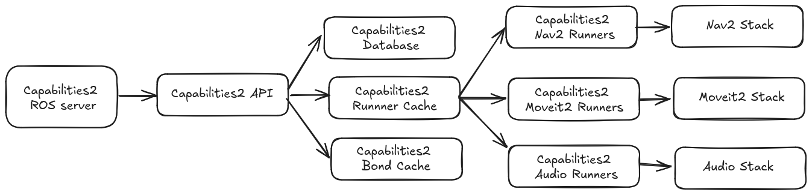

# capabilities2

A reimplementation of the [capabilities](https://github.com/osrf/capabilities) package. This package is implemented using CPP and extends the capabilities package features.

## System structure

## Motivation

The capabilities package was originally implemented using Python. This package is a reimplementation of the capabilities package using CPP. The CPP implementation is more efficient. Secondly, this package extends the capabilities package features.

The main reasons for this are:

- To allow the capabilities service to provide details of the robot to other robots, an UI or App, or a supervisory AI with a conversational style.
- To allow packages to register their capabilities with the capabilities service using a service API or a spawner.
- To allow capabilities to be used like actions and not just started and stopped by the capabilities service.
- To add state to the capabilities service using a database. This allows the capabilities service or the robot to be restarted without losing state, and hot reloading.
- To allow the capabilities service to be used as a library.
